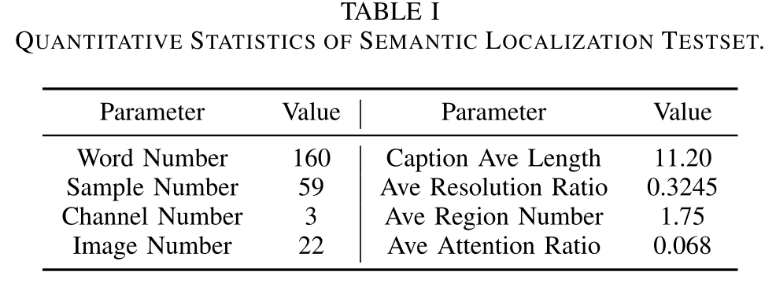
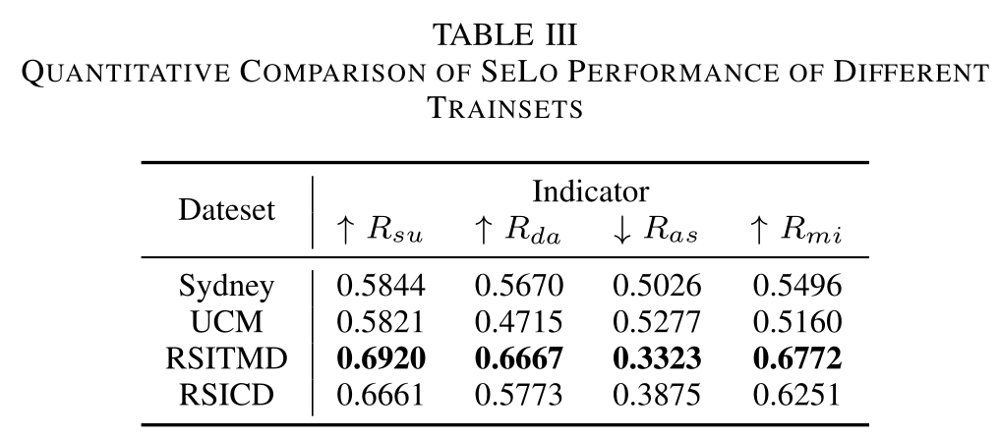
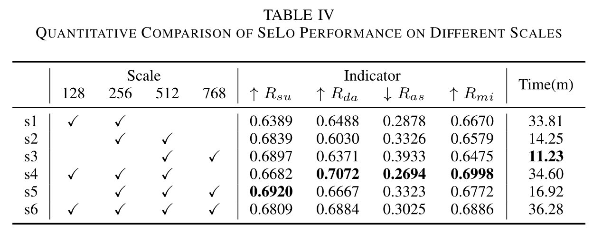
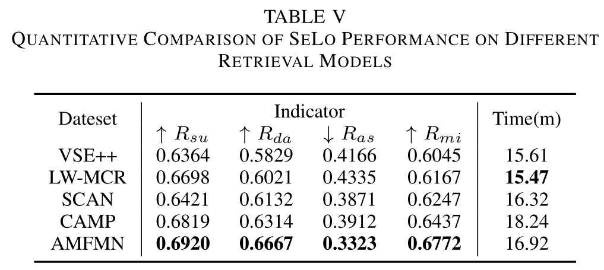

# Learning to Evaluate Peformance of Multi-modal Semantic Localization
##### Author: Zhiqiang Yuan, Chongyang Li, Zhuoying Pan, et. al 

<a href="https://github.com/xiaoyuan1996/retrievalSystem"></a>


<a href="https://pypi.org/project/mitype/"></a>

### -------------------------------------------------------------------------------------
### Welcome :+1:_<big>`Fork and Star`</big>_:+1:, then we'll let you know when we update

### -------------------------------------------------------------------------------------

#### Contexts

* [Introduction](#introduction)
* [Dataset And Metrics](#dataset-and-metrics)
  * [Testdata](#testdata)
  * [Metrics](#metrics)
* [Baselines](#baselines)
  * [Comparison of SeLo Performance of Different Trainsets](#comparison-of-selo-performance-of-different-trainsets)
  * [Comparison of SeLo Performance of Different Scales](#comparison-of-selo-performance-of-different-scales)
  * [Comparison of SeLo Performance of Different Retrieval Models](#comparison-of-selo-performance-of-different-retrieval-models)
  * [Analysis of Time Consumption](#analysis-of-time-consumption)
* [Implementation](#implementation)
  * [Environment](#environment)
  * [Run The Demo](#run-the-demo)
  * [Customize Model](#customize-model)
* [Epilogue](#epilogue)
* [Citation](#citation)
### -------------------------------------------------------------------------------------

## INTRODUCTION
An official evaluation metric for semantic localization.

The semantic localization (SeLo) task refers to using cross-modal information such as text to quickly localize RS images at the semantic level [\[link\]](https://ieeexplore.ieee.org/document/9437331).
This task implements semantic-level detection, which only uses caption-level supervision information.
In our opinion, it is a meaningful and interesting work, which realizes the unification of sub-tasks such as detection and segmentation.


We contribute test sets, evaluation metrics and baselines for semantic localization, and provide a detailed demo to use this evaluation framework.
Any questions can open a Github [issue](https://github.com/xiaoyuan1996/SemanticLocalizationMetrics/issues).
Start and enjoy!


### -------------------------------------------------------------------------------------

## DATASET AND METRICS

#### TESTDATA



#### METRICS


| Indicator | Range | Meaning  |
| --------- | ------| ---------|
| Rsu  | ↑ [ 0 ~ 1 ] | Calc the salient area proportion |
| Ras  | ↓ [ 0 ~ 1 ] | Makes attention center close to annotation center |  
| Rda  | ↑ [ 0 ~ 1 ] | Makes attention center focus on one point |
| Rmi  | ↑ [ 0 ~ 1 ] | Calculate the mean indicator of SeLo task |


## BASELINES

#### Comparison of SeLo Performance of Different Trainsets


#### Comparison of SeLo Performance of Different Scales


#### Comparison of SeLo Performance of Different Retrieval Models


#### Analysis of Time Consumption


## IMPLEMENTATION

#### ENVIRONMENT

1.Pull our project and install the requirements, make sure the code path only include English: 
    
```
   $ apt-get install python3
   $ git clone git@github.com:xiaoyuan1996/SemanticLocalizationMetrics.git
   $ cd SemanticLocalizationMetrics
   $ pip install -r requirements.txt
```

2.Prepare checkpoints and test iamges:


* Download pretrain checkpoints **SLM_checkpoints.zip** to **./predict/checkpoints/** from [BaiduYun (passwd: NIST)](https://pan.baidu.com/s/1DyRbY7s3jx-ZCWbcC_XHlw) or [GoogleDriver](https://drive.google.com/drive/folders/1LISJHiLVxPCiry1i7xJtOvuQ77nbEZD1?usp=sharing), make sure:
   
  + ./predict/checkpoints/
    + xxx.pth

* Download test images **SLM_testimgs.zip** to **./test_data/imgs/** from [BaiduYun (passwd: NIST)](https://pan.baidu.com/s/1DyRbY7s3jx-ZCWbcC_XHlw) or [GoogleDriver](https://drive.google.com/drive/folders/1LISJHiLVxPCiry1i7xJtOvuQ77nbEZD1?usp=sharing), make sure:

  + ./test_data/imgs/
    + xxx.tif

3.Download SkipThought Files to **/data** from [seq2vec (Password:NIST)](https://pan.baidu.com/s/1jz61ZYs8NZflhU_Mm4PbaQ) (or other path, but you should change the **option['model']['seq2vec']['dir_st']**)

4.Check the environments

```
    $ cd predict
    $ python model_encoder.py
    
    visual_vector: (512,)
    text_vector: (512,)
    Encoder test successful!
    Calc sim successful!
```


#### RUN THE DEMO
Run the follow command, and generated SeLo maps will be saved in **cache/**. 
```
   $ cd predict
   $ nohup python generate_slm.py --cache_path cache/RSITMD_AMFMN
   $ tail -f cache/RSITMD_AMFMN/log.txt

    2022-05-05 22:01:58,180 - __main__ - INFO - Processing 31/59: 20.jpg
    2022-05-05 22:01:58,180 - __main__ - INFO - Corresponding text: lots of white and black planes parked inside the grey and white airport.
    
    2022-05-05 22:01:59,518 - __main__ - INFO - img size:10000x10001
    2022-05-05 22:01:59,518 - __main__ - INFO - Start split images with step 256
    2022-05-05 22:02:02,657 - __main__ - INFO - Start split images with step 512
    2022-05-05 22:02:04,077 - __main__ - INFO - Start split images with step 768
    2022-05-05 22:02:04,818 - __main__ - INFO - Image ../test_data/imgs/20.jpg has been split successfully.
    2022-05-05 22:02:04,819 - __main__ - INFO - Start calculate similarities ...
    2022-05-05 22:02:48,182 - __main__ - INFO - Calculate similarities in 43.36335849761963s
    2022-05-05 22:02:48,182 - __main__ - INFO - Start generate heatmap ...
    2022-05-05 22:03:40,673 - __main__ - INFO - Generate finished, start optim ...
    2022-05-05 22:03:45,500 - __main__ - INFO - Generate heatmap in 57.31790471076965s
    2022-05-05 22:03:45,500 - __main__ - INFO - Saving heatmap in cache/heatmap_31.jpg ...
    2022-05-05 22:03:45,501 - __main__ - INFO - Saving heatmap in cache/addmap_31.jpg ...
    2022-05-05 22:03:45,501 - __main__ - INFO - Saving heatmap in cache/probmap_31.jpg ...
    2022-05-05 22:03:48,540 - __main__ - INFO - Saved ok.
    2022-05-05 22:03:59,562 - root - INFO - Eval cache/probmap_31.jpg
    2022-05-05 22:03:59,562 - root - INFO - +++++++ Calc the SLM METRICS +++++++
    2022-05-05 22:03:59,562 - root - INFO - ++++     ↑ Rsu [0 ~ 1]:0.9281   ++++
    2022-05-05 22:03:59,562 - root - INFO - ++++     ↑ Rda [0 ~ 1]:0.4689   ++++
    2022-05-05 22:03:59,562 - root - INFO - ++++     ↓ Ras [0 ~ 1]:0.0633   ++++
    2022-05-05 22:03:59,562 - root - INFO - ++++     ↑ Rmi [0 ~ 1]:0.8163   ++++
    2022-05-05 22:03:59,562 - root - INFO - ++++++++++++++++++++++++++++++++++++
    ...  

   $ ls cache/RSITMD_AMFMN
```


#### CUSTOMIZE MODEL

1. Put the pretrain ckpt file to **checkpoints**. 
2. Add your own model to **layers** and corresponding config yaml to **options/**.
3. Change **model_init.model_init** to your own models.
4. Add the class of  **EncoderSpecModel** to **model_encoder.py**.
5. Run:
```
python generate_slm.py --yaml_path option/xxx.yaml --cache_path cache/xxx
```

## EPILOGUE
So far, our attitude towards the semantic localization task is positive and optimistic, which realizes the detection at the semantic level with only the annotation at the caption level.
We sincerely hope that this project will facilitate the development of semantic localization tasks.
We welcome researchers to look into this direction, which is a possibility to achieve refined object semantic detection.

## CITATION
```
Z. Yuan et al., "Exploring a Fine-Grained Multiscale Method for Cross-Modal Remote Sensing Image Retrieval," in IEEE Transactions on Geoscience and Remote Sensing, doi: 10.1109/TGRS.2021.3078451.

Z. Yuan et al., "A Lightweight Multi-scale Crossmodal Text-Image Retrieval Method In Remote Sensing," in IEEE Transactions on Geoscience and Remote Sensing, doi: 10.1109/TGRS.2021.3124252.

Z. Yuan et al., "Remote Sensing Cross-Modal Text-Image Retrieval Based on Global and Local Information," in IEEE Transactions on Geoscience and Remote Sensing, doi: 10.1109/TGRS.2022.3163706.

Z. Yuan et al., "Learning to Evaluate Peformance of Multi-modal Semantic Localization," undergoing review.
```