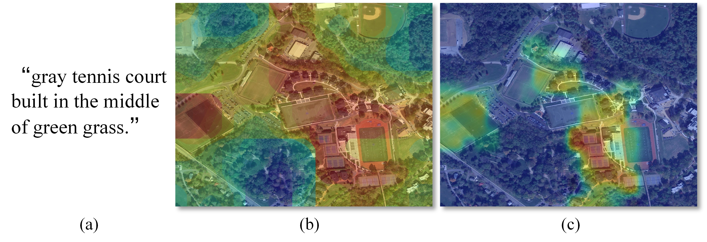
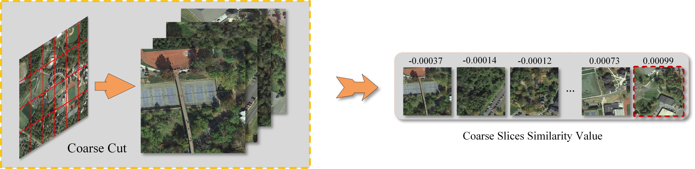
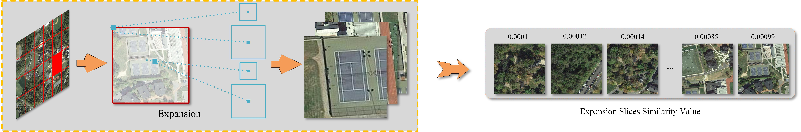
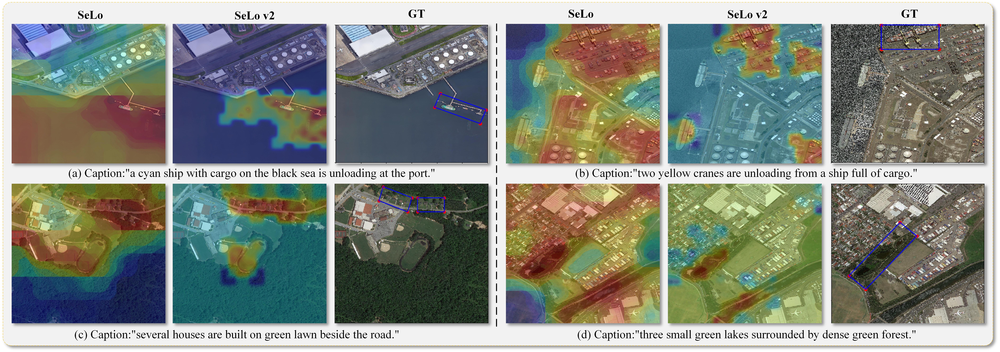

# Introduction

Based on SeLo, we conduct a more in-depth exploration and propose SeLo v2. Compared with initial SeLo framework, SeLo v2 has better semantic localization performance with only half the time consumed, which show the great advantages of SeLo v2 in terms of time and accuracy.

(a) Caption (b) SeLo (c) SeLo v2. SeLo refers to the task of obtaining the most relevant locations in large-scale RS images using semantic information such as text. Compared with SeLo, SeLo v2 weakens the attention of non-target pixels and achieves more detailed semantic-level retrieval.

# Method

## Multilevel Likelihood Expansion

In the first stage, the RS image is cropped with a larger scale and a single ratio. The purpose of this cropping method is to make the large slice contain more semantic information and roughly lock the slice where the target object may be located.

In the second stage, we use the pixel continuity of the target object to perform multi-scale expansion inward and outward on the initially determined large slice. 

## Chaotic Self-feeding Mechanism

Fig. 3. Schematic diagram of the proposed chaotic self-feeding mechanism.In the case of a small number of samples, the features generated by the text encoder are not stable. For this reason, CSM regards it as a high-frequency feature, and generates a fundamental frequency representationthrough confusion to obtain a more stable representation.

# Results

Quantitative Comparison of SeLo Performance on Different

|     Model      |    ↑Rsu    |    ↑Rda    |    ↓Ras    |    ↑Rmi    |  Time(m)  |
| :------------: | :--------: | :--------: | :--------: | :--------: | :-------: |
|     VSE++      |   0.6364   |   0.5829   |   0.4166   |   0.6045   |   25.23   |
|     LW-MCR     |   0.6698   |   0.6021   |   0.4335   |   0.6167   |   25.01   |
|      SCAN      |   0.6421   |   0.6132   |   0.3871   |   0.6247   |   26.38   |
|      CAMP      |   0.6819   |   0.6314   |   0.3912   |   0.6437   |   29.48   |
|     AMFMN      |   0.6920   |   0.6667   |   0.3323   |   0.6772   |   27.35   |
| **AMFMN-ours** | **0.7199** | **0.6658** | **0.2925** | **0.7021** | **13.34** |

Experimental Results of SeLo V2 Method with Different Structures

| Ablation Method | VS   | MLE  | STE  | CSM  | Med  | Gass | ↑Rsu   | ↑Rda   | ↓Ras   | ↑Rmi   | Time(m) |
| :-------------: | ---- | :--: | ---- | ---- | ---- | :--: | ------ | ------ | ------ | ------ | ------- |
|       m1        | √    |      | √    |      | √    |      | 0.6920 | 0.6667 | 0.3323 | 0.6772 | 27.3510 |
|       m2        |      |  √   | √    |      | √    |      | 0.6976 | 0.6381 | 0.3302 | 0.6730 | 22.7770 |
|       m3        | √    |      | √    |      |      |  √   | 0.6942 | 0.6792 | 0.3164 | 0.6867 | 23.2008 |
|       m4        |      |  √   | √    |      |      |  √   | 0.7002 | 0.6575 | 0.3330 | 0.6780 | 14.3155 |
|       m5        |      |  √   |      | √    |      |  √   | 0.7199 | 0.6658 | 0.2975 | 0.7021 | 13.3447 |

This paper proposes a multilevel likelihood expansion and chaotic self-feeding mechanism for faster and higher SeLo task. Qualitative and quantitative experiments show that the proposed SeLo v2 has effectively promoted the development of RS image SeLo tasks.
